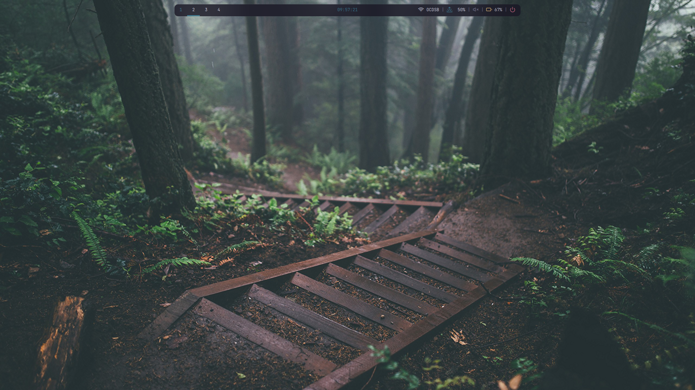

# Oatmeal-OS
Personal Dotfiles/OS in progress, currently going under rebuilding. Simple tiling environment using catppuccin frappe as a colourscheme. Plans to make a super fancy rice with openbox in the future. This is meant to be more or less dependable fallback for when errors occur on work-in-progress rices. This rice is almost always about to change.

## Screenshot

  


## Install
Copy files from config folder to .config, everything else goes to home directory, hidden.
Make all shell scripts executable, ex. bspwmrc, bspfloat.sh and wifi-menu.sh

Install the following:
```
alacritty
urxvt
feather and jetbrainsmono fonts
bspwm
polybar
feh
rofi
neovim + vim-plug
zsh + oh-my-zsh
betterlockscreen
```
All of these should be available in the AUR

### Setup
Open tty, with zsh as default zsh and run `startbsp` bspwm should open with background and polybar, if there are errors, make sure bspwmrc is executable and is in ~/.config/bspwm open Alacritty with `Super + Return` and open neovim, ignore errors and run `:PlugInstall` to install plugins, no errors should show now

# Roadmap
- [x] Figure out which WM to use (BSPWM)
- [ ] Package everything
