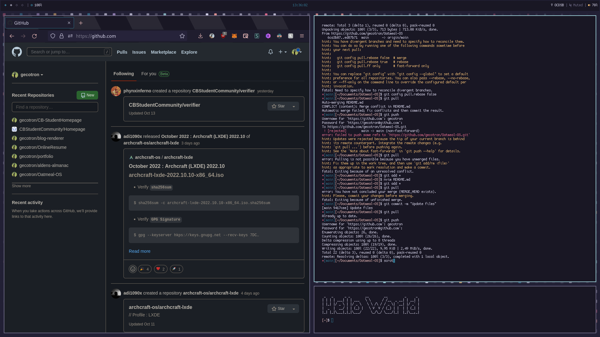
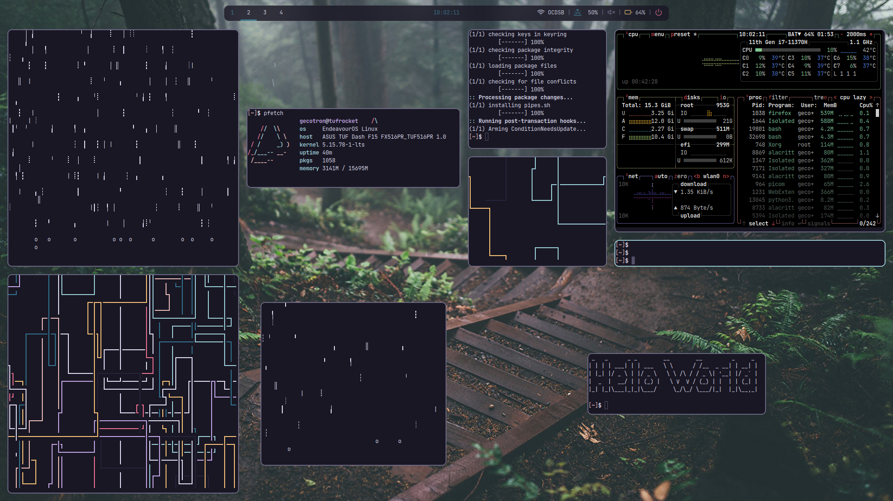

# Oatmeal-OS
Personal Dotfiles/OS in progress

## Screenshot


## Tiling Chaos


## Install
Copy files from config folder to .config, everything else goes to home directory, hidden.
Make all shell scripts executable, ex. bspwmrc, bspfloat.sh and wifi-menu.sh

Install the following:

```
urxvt
bspwm
Polybar
feh
rofi
neovim + vim-plug
zsh + oh-my-zsh
betterlockscreen
```

### Setup
Open tty, with zsh as default zsh and run `startbsp` bspwm should open with background and polybar, if there are errors, make sure bspwmrc is executable and is in ~/.config/bspwm
open urxvt and open neovim, ignore errors and run `:PlugInstall` to install plugins, no errors should show now

# Roadmap
- [ ] Figure out which WM to use (Currently BSPWM, likely to change)
- [ ] Learn and make EWW bar + widgets
- [ ] Package everything
